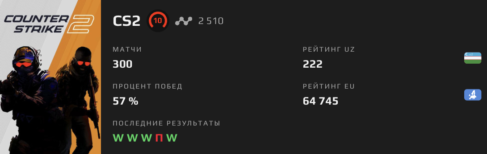

  

  

  
  
  
  

  
  
  

  

## ⚡ Обо мне
- Frontend: **HTML, CSS, JavaScript, React**
- Backend: **Node.js (Express)**
- Tools: **VS Code, PyCharm, Linux**
- Плюс: **Photoshop, AI tools, Video Editing, Design**
- Цель: быстрые, чистые, минималистичные продукты

## 🧰 Стек

  
  
  
  
  
  
  
  

## 🎮 CS2 / Steam

  

  
  
  

  

  

## 🚀 Проекты

  
  

  

<!-- “чипсы” со стеком — монохром -->

  
  &nbsp;&nbsp;
  
  &nbsp;&nbsp;
  

  
<b>➕ Ещё проекты</b>

- 📝 Notes App — React + Express  
- 🖼 Image Tools — Node + Canvas  
- 🎮 Mini Games — JS  

## 📊 Статистика (моно)

  
  

  

  

  

## ✨ Случайная мысль

  

ъ## 🐍 GitHub Snake Animation

  <picture>
    <source media="(prefers-color-scheme: dark)" srcset="https://raw.githubusercontent.com/ahmad2391778/ahmad2391778/output/snake-neon.svg?v=2">
    <source media="(prefers-color-scheme: light)" srcset="https://raw.githubusercontent.com/ahmad2391778/ahmad2391778/output/snake-light.svg?v=2">
    
  </picture>

## 📚 Учусь и цели
- Изучаю: **React Hooks**, **Next.js**, **TypeScript**  
- Цели: **аутентификация**, **деплой (Vercel/Render)**, **3 кейса/статьи**

  

  Made with ⚫⚪ minimalism.

